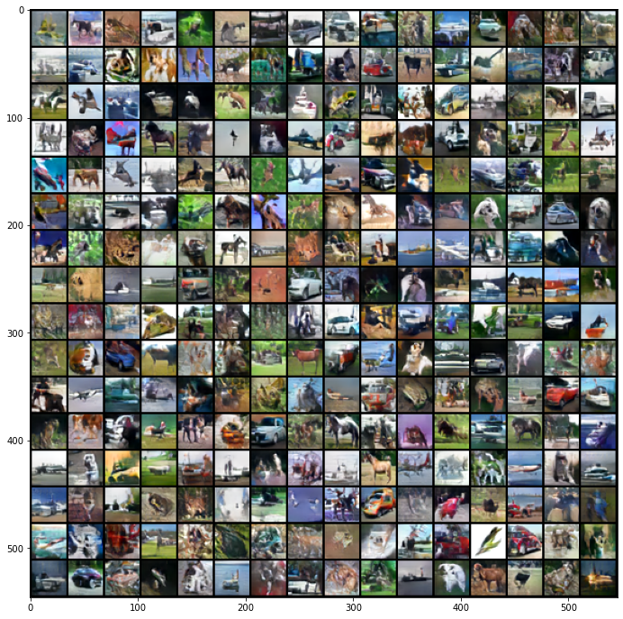
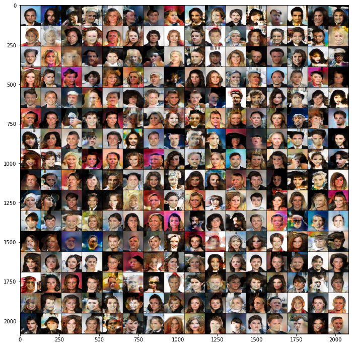

# [MSG-GAN: Multi-Scale Gradients for Generative Adversarial Networks](https://arxiv.org/pdf/1903.06048.pdf)

Animesh Karnewar and Oliver Wang

*CVPR 2020*

This folder provides a re-implementation of this paper in PyTorch, developed as part of the course METU CENG 796 - Deep Generative Models. The re-implementation is provided by:

* Deniz A. Acar, denizalperacar@gmail.com

* Yavuz Durmazkeser, yavuz.durmazkeser@metu.edu.tr

Please see the jupyter notebook file [main.ipynb](main.ipynb) for a summary of paper, the implementation notes and our experimental results.

**Solution to CelebA Download Error**: In case the code fails to download CelebA Dataset, download [this](https://drive.google.com/drive/folders/1hDQKv_NbYv2lk2sdBiVPQQivMWNSqTOC?usp=sharing) folder and place it under data/.